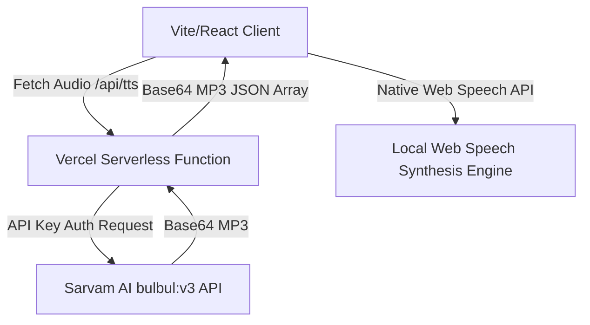

# Comprehensive Diagnostic, Stabilization, Responsiveness & UX Stability Audit

This audit provides a brutally honest, highly practical, and technically rigorous evaluation of the **Lumina Reading Assistant** application. It focuses on simple, robust, and maintainable solutions suitable for a single-developer personal-use application, prioritizing stability and mobile-first UX over unnecessary architectural overhead.

---

## 1. Codebase Architecture Analysis

### Architectural Overview
The application is structured as a single-page React app with a serverless Vercel function backend.
*   **Backend (`api/tts.js`)**: A lean, secure, stateless API forwarding audio synthesis requests to Sarvam AI. It handles API key secrecy and text validation perfectly.
*   **Frontend**: Built with a single primary entry point (`src/App.jsx`), one custom sub-component (`WordSpan`), and a redundant/unused configuration file (`src/SettingsPanel.jsx`).



### Good Architectural Decisions (Should Remain Unchanged)
1.  **Pure Functions Outside Component Scope**: Tokens, sanitization, Unicode character weighting, voice ranking, and search functions (`tokenizeText`, `sanitizeText`, `detectLanguageCode`, `findWordByCharIndex`, `buildWeightedPositions`) are declared globally at the module level. This prevents unnecessary closure creation, memory allocations, and scoping bugs on every React render.
2.  **Granular React Memoization (`WordSpan`)**: Wrapping the individual word rendering in `React.memo` is an excellent choice. It restricts re-renders to only the transition boundaries (the newly active word and the previously active word), achieving $O(1)$ rendering complexity instead of $O(N)$ (where $N$ is the total word count).
3.  **Secure Server-Side Key Management**: Shifting premium neural API calls from client-side execution to a serverless Vercel proxy protects the developer's subscription keys from client exposure.
4.  **Brave Shield Protection (`safeLocalStorage`)**: A simple, excellent abstraction layer wrapping standard storage reads/writes in a defensive `try-catch` block. This keeps the application from crashing on launch when sandboxed inside restrictive iframe environments, Private Browsing modes, or privacy browsers like Brave.

### Architectural Risks & Pain Points

#### 1.1 Unused Encrypted API Key Management Leftovers
*   **Problem**: `src/SettingsPanel.jsx` contains 186 lines of complex key decryption/encryption logic using `PBKDF2` and `AES-GCM` via the browser's Web Crypto API, alongside masks, hooks, and modals. However, it is **never imported or referenced** anywhere in the application.
*   **Root Cause**: Leftover dead code from a previous architectural phase (prior to Vercel backend migration) where users managed keys locally.
*   **Impact**: Wasted bundle size, increased cognitive load, and confusion about how credentials are authenticated.
*   **Recommended Fix**: Remove `src/SettingsPanel.jsx` completely.
*   **Action**: Worth fixing now (trivially simple deletion).

#### 1.2 Tightly Coupled Dual-Engine Control Flow
*   **Problem**: Speech synthesis control flow is deeply entangled with raw UI actions. Conditional checks (`if (ttsEngine === "sarvam")`) are duplicated inside `handlePlay`, `handlePause`, `handleStop`, and `jumpToWord`.
*   **Root Cause**: Monolithic single-file component structure without a clean playback wrapper.
*   **Impact**: High risk of regression when modifying playback states. Adding engine features or resolving playback bugs requires traversing 1,200 lines of mixed UI and control code.
*   **Recommended Fix**: Do not rewrite into complex state machines. Instead, cleanly unify state properties (e.g., ensuring `resetPlayback` cleanly stops both engines) and avoid divergent handlers.
*   **Action**: Worth stabilizing now.

---

## 2. Performance & Stability Audit

### 2.1 Critical Performance Bottleneck: High-Frequency Cumulative Re-calculation in the RAF Loop
*   **Problem**: In `sarvam` playback mode, the application stutters, drops frames, and experiences CPU spikes (especially on mobile) during long reading sessions.
*   **Root Cause**: Look at lines 360–367 in `src/App.jsx`:
    ```javascript
    const syncSarvamHighlight = useCallback(() => {
      const audio = sarvamAudioRef.current;
      if (!audio || !audio.duration || words.length === 0) return;

      const { cumulative, totalWeight } = buildWeightedPositions(text);
      ...
    ```
    This function is executed inside the `requestAnimationFrame` (RAF) loop on **every single frame (60 times per second)**. Recalculating `buildWeightedPositions(text)` inside a high-frequency animation loop is an extremely expensive $O(N)$ operation. On every frame, it allocates a new array, runs a loop through thousands of characters of text, calculates cumulative weights, and throws the array away, causing massive garbage collection pressure, rendering lag, and browser crashes on lower-end mobile devices during long documents.
*   **Impact**: Severe CPU thrashing and frame drops. CPU-bound rendering makes scrolling unresponsive during active reading.
*   **Recommended Fix**: Calculate and cache the weighted positions (`cumulative` and `totalWeight`) **once** when the text is loaded, or when synthesis begins. Save it in a React `useMemo` or a component ref, and pass this cached data to the sync loop.
*   **Action**: **Critical. Must fix immediately.**

#### 2.2 Inline Ref Callbacks Allocation
*   **Problem**: On line 1201 in `src/App.jsx`:
    ```javascript
    spanRef={(el) => { wordRefs.current[index] = el; }}
    ```
    An inline arrow function is allocated for every single word span in the document during rendering.
*   **Root Cause**: Inline anonymous ref assignment.
*   **Impact**: In React, inline ref callbacks are called twice during updates (first with `null` then with the DOM element) if the callback reference changes. If a document has 1,500 words, this causes 3,000 ref invocations on every render, triggering constant garbage collection and performance degradation.
*   **Recommended Fix**: Replace the inline callback with a static index-based function, or let `WordRefs` populate cleanly by moving ref registration to the child or utilizing a single parent container search. For a simpler solution, memoize word references or structure them to prevent double-execution.
*   **Action**: Worth fixing now.

#### 2.3 Layout Reflow Thrashing from `getBoundingClientRect`
*   **Problem**: Active word tracking triggers continuous layout calculations.
*   **Root Cause**: The scroll effect (lines 510–519) runs whenever `currentIndex` changes:
    ```javascript
    const rect = el.getBoundingClientRect();
    const inView = rect.top >= 80 && rect.bottom <= window.innerHeight - 80;
    if (!inView) { el.scrollIntoView({ behavior: "instant", block: "center" }); }
    ```
    Calling `getBoundingClientRect()` forces the browser to synchronously compute the layout of the page (reflow), stalling the main thread.
*   **Impact**: Minor micro-stutters during word transitions, noticeable on battery-restricted mobile devices.
*   **Recommended Fix**: Instead of checking bounding clients on every single word transition, implement a threshold check or rely on browser `IntersectionObserver` attached to active spans, or compute margins natively using offset heights without forcing synchronous layouts.
*   **Action**: Worth fixing later/minor optimization.

---

## 3. Responsive Design & Mobile-First Audit

### 3.1 Severe Mobile UX Regression: Fixed Dock Becomes Static
*   **Problem**: On mobile viewports ($< 768px$), the media control player dock is not anchored at the bottom of the screen.
*   **Root Cause**: Line 73 of `src/index.css` overrides the floating dock styles:
    ```css
    @media (max-width: 767px) {
      ...
      .dock-container {
        position: static !important;
        border-radius: 0 !important;
        box-shadow: none !important;
        backdrop-filter: none !important;
        padding-left: 12px !important;
        padding-right: 12px !important;
      }
    }
    ```
    This turns the media dock into a static inline block element at the very bottom of the document wrapper.
*   **Impact**: High-severity usability barrier on mobile devices. If a user loads a long document (e.g., 2,000 words), the player controls scroll out of view immediately. To pause, rewind, or scrub through the audio, the user is forced to stop reading, scroll thousands of pixels down to the bottom of the page, tap a button, and scroll back up to locate their position. 
*   **Recommended Fix**: Restore fixed anchoring (`position: fixed !important`) on mobile devices. Use responsive padding safe-areas (`env(safe-area-inset-bottom)`) to ensure it clears system gesture pills (iOS/Android home bars) beautifully.
*   **Action**: **Critical. Must fix immediately.**

### 3.2 Cramped Mobile Text Margins
*   **Problem**: Mobile viewports display cramped typography margins.
*   **Root Cause**: Custom CSS forcing extremely thin boundaries:
    ```css
    @media (max-width: 479px) {
      .app-container {
        padding-left: 8px !important;
        padding-right: 8px !important;
      }
    }
    ```
*   **Impact**: Visual clutter. Having only `8px` of horizontal margin makes reading feel crowded, leading to eye fatigue during long reading sessions.
*   **Recommended Fix**: Relax mobile horizontal margins to a minimum of `16px` to `20px` to respect premium readability spacing.
*   **Action**: High Priority.

---

## 4. UI/UX Simplification Review

### 4.1 Keystroke-Level Auto-Language Shifting Thrashing
*   **Problem**: Typing or editing text triggers constant disruptive UI state changes and screen alerts.
*   **Root Cause**: The auto-language detection logic is attached to a global `useEffect` that listens directly to the `text` state (which updates on **every single keystroke** in the edit textarea).
*   **Impact**: If a user is typing a text containing mixed scripts or Hindi conjuncts, the app immediately intercepts the typing flow, shows a toast notification ("*Hindi text detected! Switched to Premium neural voice...*"), and alters dropdown select values *while* the user is mid-word. This is incredibly intrusive and frustrating.
*   **Recommended Fix**: Restrict the auto-language shifting trigger. It should only run **once** when a user imports/uploads a document, or when the user initiates playback via the **Play** button, rather than firing continuously on every keystroke.
*   **Action**: **High Priority.**

### 4.2 Inconsistent Timeline Audio Pausing
*   **Problem**: Dragging the scrubber slider does not pause audio when using the premium Sarvam AI engine.
*   **Root Cause**: In `handleScrubStart` (lines 885–887):
    ```javascript
    if (playbackState === "playing") {
      window.speechSynthesis.pause();
    }
    ```
    This only pauses the browser-native synthesis engine. It completely ignores the active HTML5 audio element playing the Sarvam stream.
*   **Impact**: Dragging the timeline scrubber while Sarvam AI is playing causes audio to continue playing in the background while the UI cursor jumps around.
*   **Recommended Fix**: Unify scrubbing actions. Pause `sarvamAudioRef.current` if active during scrubber interactions, and resume playback cleanly on `handleScrubEnd`.
*   **Action**: High Priority.

### 4.3 Redundant Time Estimation in Sarvam Mode
*   **Problem**: Timeline duration displays estimated times instead of actual progress values during Sarvam AI playback.
*   **Root Cause**: The timeline indicators use a rough word count speed approximation (`avgWordSec = 0.3 / rate`) for both engines.
*   **Impact**: When playing Sarvam premium audio, the remaining time counts down based on a generic guess rather than the actual duration of the loaded MP3. This causes visual mismatching where the audio ends early or late relative to the scrubber timeline.
*   **Recommended Fix**: If `ttsEngine === "sarvam"`, feed direct HTML5 audio parameters (`audio.currentTime` and `audio.duration`) directly into the progress calculations instead of relying on the word approximation.
*   **Action**: Medium Priority.

---

## 5. Accessibility Audit

### 5.1 Global Playback Interceptor Violates Browser Button Navigation
*   **Problem**: Navigating the UI via keyboard and attempting to select buttons triggers the audio player instead of activating the targeted control.
*   **Root Cause**: Look at lines 909–916 in the global keyboard listener:
    ```javascript
    const onKey = (e) => {
      const tag = document.activeElement?.tagName;
      if (tag === "TEXTAREA" || tag === "INPUT" || tag === "SELECT") return;
      if (e.code === "Space") {
        e.preventDefault();
        if (playbackRef.current === "playing") handlePause();
        else handlePlay();
      }
      ...
    ```
    If a keyboard-only user uses the `Tab` key to focus on the **Theme Toggle** button or the **Upload** button and presses the standard browser activation key (`Spacebar`), the listener intercepts the keydown event, runs `e.preventDefault()`, and starts playing audio instead of triggering the targeted button.
*   **Impact**: Severe accessibility barrier. Keyboard-only users are trapped and cannot trigger any button controls with the spacebar.
*   **Recommended Fix**: Exclude active button elements from global spacebar capture. If `document.activeElement.tagName === "BUTTON"`, return early and let the native event execute.
*   **Action**: **High Priority.**

---

## 6. Code Quality Review

### 6.1 Dual Error State Smell
*   **Problem**: Component defines two separate error states.
*   **Root Cause**: Lines 221–222:
    ```javascript
    const [error, setError] = useState("");
    const [errorMessage, setErrorMessage] = useState("");
    ```
    `error` is used for in-app inline banners. `errorMessage` is used in a fixed toast absolute position block (lines 973–977), but **`setErrorMessage` is never called** in the entire application!
*   **Impact**: Confusing code, dead markup, and wasted state allocations.
*   **Recommended Fix**: Consolidate into a single robust error-handling channel. Remove the unused `errorMessage` state and its associated unused markup.
*   **Action**: Medium Priority (clean code/lint warning safety).

### 6.2 Missing Event Listener Cleanups in React 18 Strict Mode
*   **Problem**: Web Speech Synthesis events may double-bind or leak memory.
*   **Root Cause**: The voice loader effect (lines 410–432) assigns `window.speechSynthesis.onvoiceschanged = loadVoices`. In React 18 Strict Mode, components mount, unmount, and remount instantly in development. The cleanup function cancels speech synthesis but fails to clear the global `onvoiceschanged` reference.
*   **Impact**: Memory leaks and potential double invocation of callbacks.
*   **Recommended Fix**: Clean up the event listener on unmount:
    ```javascript
    return () => {
      window.speechSynthesis.onvoiceschanged = null;
      window.speechSynthesis.cancel();
    };
    ```
*   **Action**: Medium Priority.

---

## 7. Issue Prioritization Report

### 7.1 Severity Classification Matrix

| Severity | Definition | Impact |
| :--- | :--- | :--- |
| **Critical** | Breaks core app functionality, degrades scrolling to unplayable states, or blocks essential mobile use. | High user frustration, crash risks. |
| **High** | Compromises primary UX features (keyboard navigation, scrubbing, editing text without interruptions). | Obvious defects impacting daily reading. |
| **Medium** | Minor structural issues, inaccurate timelines, or clean code violations. | Small visual or code quality gaps. |
| **Low** | Aesthetic preferences, micro-optimizations, or minor enhancements. | Negligible impact on core user tasks. |

---

### 7.2 Prioritized Action Items Checklist

#### 1. Critical Issues

##### A. CPU Optimization: Remove High-Frequency Re-calculation inside sync loop
*   **Root Cause**: `buildWeightedPositions(text)` runs inside the animation tick at 60fps.
*   **Impact**: Stuttering, lag, high battery drain, and page freezing on long documents.
*   **Solution**: Cache weighted positions in a ref or state upon loading text.
*   **Engineering Complexity**: Low (5 lines of changes).
*   **Risk of Regression**: Extremely low.
*   **UX/Performance Benefit**: Maximum (restores smooth 60fps scrolling and rendering).

##### B. Restore Fixed Position Bottom Dock on Mobile
*   **Root Cause**: CSS media query overrides bottom dock position to `static`.
*   **Impact**: Mobile users must scroll all the way to the end of long documents to access player controls.
*   **Solution**: Keep the dock locked at `position: fixed` with appropriate safe bottom paddings.
*   **Engineering Complexity**: Low (CSS adjustments).
*   **Risk of Regression**: Low (requires checking layout padding overlap).
*   **UX/Performance Benefit**: High (essential for one-handed mobile usability).

---

#### 2. High Priority Improvements

##### C. Relocate Auto-Language and Voice Shifting Detection
*   **Root Cause**: Detector hook triggers on every keystroke (`text` state updates).
*   **Impact**: Annoying toast alerts and select resets *while the user is active in the text input*.
*   **Solution**: Trigger the check only when text editing loses focus, or once when hitting the **Play** button.
*   **Engineering Complexity**: Low.
*   **Risk of Regression**: Low.
*   **UX/Performance Benefit**: High (restores fluid editing experience).

##### D. Resolve Spacebar Keyboard Traps for Buttons
*   **Root Cause**: Global event listener calls `e.preventDefault()` on spacebar regardless of active focus.
*   **Impact**: Users tabbed onto theme toggles or tab headers trigger playback toggles instead of selecting buttons.
*   **Solution**: Avoid blocking space events if `document.activeElement` is an interactive control (`BUTTON`, `A`).
*   **Engineering Complexity**: Low.
*   **Risk of Regression**: Very low.
*   **UX/Performance Benefit**: High (resolves major web accessibility barriers).

##### E. Unify Timeline Scrubbing Pause for both engines
*   **Root Cause**: `handleScrubStart` only pauses browser `speechSynthesis`.
*   **Impact**: Sarvam AI audio continues blaring out of sync during slider dragging.
*   **Solution**: Pause the active HTML5 audio element during scrubbing and resume on mouse release.
*   **Engineering Complexity**: Medium (requires tracking engine checks).
*   **Risk of Regression**: Low.
*   **UX/Performance Benefit**: High (consistent timeline interaction).

---

#### 3. Medium & Low Priority Improvements

##### F. Consolidate Duplicate Error States & Toast Markup
*   **Root Cause**: Redundant and unused state allocation (`errorMessage`).
*   **Impact**: Dead code bloat.
*   **Solution**: Merge all alerts into the standard `error` state. Remove duplicate toast components.
*   **Engineering Complexity**: Low.
*   **Risk of Regression**: Zero.
*   **UX/Performance Benefit**: Moderate (improved maintainability).

##### G. Feed Accurate Milliseconds to Sarvam Timeline Scrubber
*   **Root Cause**: Scrubber estimates playback timestamps instead of reading actual stream progress.
*   **Impact**: Scrubber jumps asynchronously when playing neural regional voices.
*   **Solution**: Use `audio.currentTime` and `audio.duration` directly for dynamic visual precision.
*   **Engineering Complexity**: Medium.
*   **Risk of Regression**: Low.
*   **UX/Performance Benefit**: Moderate (premium aesthetic precision).

##### H. Delete Orphaned `src/SettingsPanel.jsx` File
*   **Root Cause**: File left over from client key encryption.
*   **Impact**: Confusion for future codebase contributors.
*   **Solution**: Permanently delete the unused file.
*   **Engineering Complexity**: Zero.
*   **UX/Performance Benefit**: Low (improves code cleanliness).

---

## 8. Final Stabilization Roadmap

For a solo developer prioritizing long-term stability and simplicity, we recommend tackling the changes in three distinct, isolated phases to ensure safe validation.

### Phase 1: Performance & Mobile Core Stability (Day 1)
Focus only on the critical regressions that affect basic usability and device performance.
1.  **Refactor Sync Loop Cache**: Memoize the cumulative character weighting of text.
2.  **Fix CSS Dock Layout**: Return the bottom control dock to `fixed` positioning on mobile viewports so it remains sticky under the reading viewport.

### Phase 2: Interactive UX Optimization (Day 2)
Address structural traps and annoying interruptions during text editing.
1.  **Modify Auto-Language trigger**: Shift language detection logic from continuous rendering to a discrete event (when clicking **Play** or leaving the editor textarea).
2.  **Fix Spacebar Navigation**: Update the global key listener to pass space inputs when focused on interactive button elements.
3.  **Synchronize Scrubber Audio**: Ensure scrubbing pauses active premium audio.

### Phase 3: Codebase Polish & a11y Details (Day 3)
Clean up code architecture and bring alignment indicators to a high premium standard.
1.  **Delete Orphaned Files**: Clear out `SettingsPanel.jsx`.
2.  **Unify Error Management**: Consolidate redundant state blocks.
3.  **Enhance Web Speech cleanups**: Properly detach `onvoiceschanged` events on unmounting.
4.  **Integrate Exact Sarvam Timestamps**: Replace estimated calculations with actual audio metrics.

---

### What should NOT be changed (Architectural Anchor Points)
*   **Do NOT separate files needlessly**: Keep the main layout and state cleanly bundled inside `App.jsx`. Segmenting into many small component files is an unnecessary abstraction for a simple personal-use project and increases development friction for a solo creator.
*   **Do NOT add external state managers**: Custom states should remain native to React's standard `useState` hooks rather than introducing heavy setups like Redux or Zustand.
*   **Do NOT complicate Vercel routes**: Keep `api/tts.js` exactly as it is—stateless, fast, and simple.

---

### Verification and Delivery Plan
When executing this roadmap:
1.  Verify locally by running `npm run dev` and testing with long document sizes (50k+ characters) on desktop and simulated mobile devices.
2.  Check frame rate rendering stability using browser DevTools Performance frames profiling.
3.  Execute `npm run build` to confirm zero build-time warnings or compilation errors.
